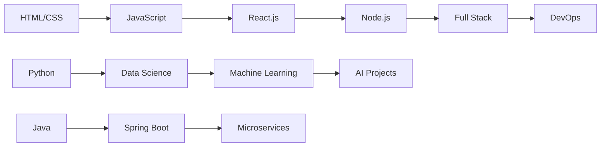

# Hi Shivam there! 👋 

<div align="center">
  
</div>

<div align="center">
  
</div>

---

## 🚀 About Me

```javascript
const bcaStudent = {
    name: "Shivam Karn",
    education: "Bachelor of Computer Applications (BCA)",
    currentYear: "2nd Year", // Update as needed
    location: "India",
    interests: ["Web Development", "Mobile Apps", "Data Science", "AI/ML"],
    currentlyLearning: ["React.js", "Node.js", "Python", "Database Management"],
    funFact: "I debug with console.log() and I'm proud of it! 😄",
    goals: ["Build amazing projects", "Contribute to open source", "Land a great internship"]
};
```

---

## 🛠️ Tech Stack & Skills

<div align="center">

### 💻 Programming Languages


### 🌐 Web Development


### 🗄️ Databases


### 🔧 Tools & Technologies


</div>

---

## 📊 GitHub Stats

<div align="center">
  
  
</div>

<div align="center">
  
</div>

<div align="center">
  
</div>

---

## 🏆 GitHub Trophies

<div align="center">
  
</div>

---

## 🎯 Current Focus

<div align="center">
  
</div>

- 🔭 I'm currently working on **Web Development Projects**
- 🌱 I'm currently learning **React.js and Node.js**
- 👯 I'm looking to collaborate on **Open Source Projects**
- 🤔 I'm looking for help with **System Design**
- 💬 Ask me about **Web Development, Python, or BCA subjects**
- 📫 How to reach me: **your.email@example.com**
- ⚡ Fun fact: **I can solve a Rubik's cube in under 2 minutes!**

---


## 📈 Learning Journey



---

## 🎨 Coding Activity

<div align="center">
  
</div>

<!--START_SECTION:waka-->
```text
JavaScript   8 hrs 15 mins   ████████████░░░░░░░░░░░░░   48.32%
Python       4 hrs 30 mins   ██████░░░░░░░░░░░░░░░░░░░   26.41%
HTML         2 hrs 45 mins   ████░░░░░░░░░░░░░░░░░░░░░   16.15%
CSS          1 hr 30 mins    ██░░░░░░░░░░░░░░░░░░░░░░░   08.82%
Other        5 mins          ░░░░░░░░░░░░░░░░░░░░░░░░░   00.30%
```
<!--END_SECTION:waka-->


---

## 📚 BCA Subjects Mastered

<div align="center">

### Semester-wise Progress

| Semester | Subjects | Status |
|:---:|:---|:---:|
| **Sem 1** | Programming Fundamentals, Mathematics, English | ✅ Completed |
| **Sem 2** | Data Structures, DBMS, Statistics | ✅ Completed |
| **Sem 3** | OOP, Web Technologies, Computer Networks | 🔄 In Progress |
| **Sem 4** | Software Engineering, OS, Java | 📅 Upcoming |

</div>

---

## 🤝 Connect with Me

<div align="center">

[](www.linkedin.com/in/shivam-karn-74a567262)
[]([https://instagram.com/yourhandle](https://www.instagram.com/_.shivam_karn/?__pwa=1))
[](https://skarn-2006.github.io/codsoft_profile/)
[](mailto:karn48438@gmail.com)

</div>

---

## 💡 Random Dev Quote

<div align="center">
  
</div>

---

## 🐍 Contribution Snake

<div align="center">
  
</div>

---

## 📊 Profile Views & Followers

<div align="center">
  
  
  
  
  
</div>


<div align="center">
  
  
  ### Thanks for visiting! 😊
  
  **"Code is like humor. When you have to explain it, it's bad."** – Cory House
  
  
  
</div>

---

<div align="center">
  
</div>
